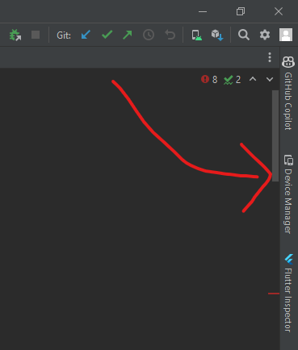
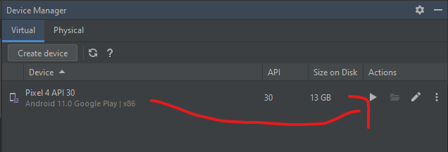
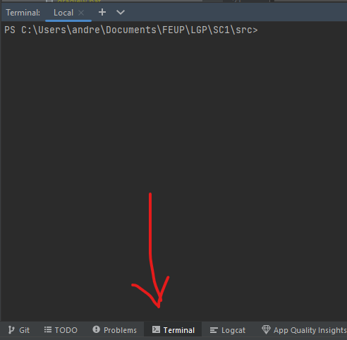

# Começar o Emulador

- Abrir Android Studio
- Abrir Device Manager 
---

- Começar emulador
---


# Atualizar a Aplicação

- Abrir o terminal
---


- Correr ```git pull```

# Correr a Aplicação

- Ainda no terminal
- Cada vez que fazes ```git pull```, corre ```.\pre_build.bat```
- Para correr a apilcação mesmo:
  - Da primeira vez ou sempre que queres apagar os teus dados e voltar a meter a aplicação a zero
    ```shell
    flutter run --flavor <flavorName> -t lib/main_<flavorName>.dart --dart-define="SEED_DB=true"
    ```
  - Outras vezes
    ```shell
    flutter run --flavor <flavorName> -t lib/main_<flavorName>.dart
    ```
  - O ```flavorName``` pode ser ```free``` ou ```premium```
